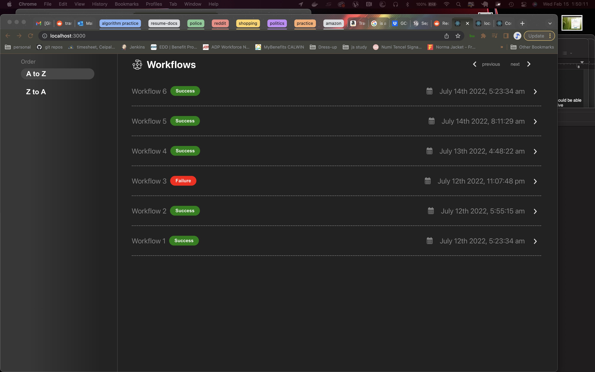

<span align="left"></span>

# Quadric front-end code challenge 
*localhost:3000*
<p align="left"></p>


## Project notes 🎙


^*Italics* == what I would do differently.^


^ 🍳 == boilerplate ^


This project was bootstrapped with [Create React App](https://github.com/facebook/create-react-app) and uses only the forked /mock folder from the original quadric-code-challenge repo.

...

Transparent png images were cut using screenshots and photoshop. 📸

...

Semantic UI React Grid widths stopped working, (I think because of an uninstall while trying to import themes), but I kept using them for CSS declarations in place. 

...

With time restrictions was not able to get build for pre-processing set up. 

...

 *On these last two points, there are several ways the project would benefit from simply having the pre-processing (LESS) working. For one, the CSS is dramatically reduced by virtue of a React integration for CSS, which has a ton of CSS under the hood and accessible with only component and prop declarations. For another, the CSS that would still be there would be much much more terse and dry...because LESS. It would be much easier to parse out the CSS into smaller more manageable imported files that aggregate the CSS that applies to them if there's LESS, meaning easier scaling for a larger code base organization, better performance, and more hassle-free CSS coding with less likelihood of accidental clobber, unforeseen cascading, etc.*

...

Didn't add "Name" and "Created" Column headers because ran out of time. 💣

...

Same for solid bottom border under column headers; ran out of time.  

...

Set up some folder structure for larger project. 
```
├── src
│   ├── components
│   │   ├── component
│   │   │   ├── Workflows.js
│   │   ├── page
│   │   │   ├── PageSections.js
│   ├── images
│   │   ├── **/*.png / **/*.svg
│   ├── styles
│   │   ├── App.css
│   │   ├── index.css
│   │   ├── slate.min.css
├── public
│   ├── favicon.io
│   ├── index.html
│   ├── manifest.json
│   ├── robots.txt
etc...
```
*Seeing that React and VSC have very intuitive and performant ways of auto-importing and finding imports that good file structure facilitates, I would think about this more and plan better for the file structure with a few things in mind: maximizing performance; improving reading and searching for developers; and none of ../../../../../../. VSC handles auto-import natively.*

*I would typically rely on both my own memory and established guidelines in file structure organization where there's time. Here I relied a bit on memory. So, for a code base with multiple pages it would look maybe more like* 

```
├── src
├────├styles
├────├js
├────├page
├────├────components
├────components
```

*It could all depend on the intended scaling. I seen tons of nesting in a performant application but everybody says don't do it too much. Organization is nice.*

...

Copied down the semantic-forest slate theme. Didn't implement. That's why all the craco content is here.

...

Finally, I renamed the scripts and added new ones in the package.json because I was a bit uncertain about whether craco was supposed to replace those run scripts or was just doing different things. I didn't like the immediate risk of script name collision or doing one thing when I wanted to do another. Maybe why the CSS is cattywampus??🔦

...
## Available Scripts

In the project directory, you can run:

🍳
  
### `npm start-ui`

Runs the app in the development mode.\
Open [http://localhost:3000](http://localhost:3000) to view it in your browser.

The page will reload when you make changes.\
You may also see any lint errors in the console.

### `npm test-ui`

Launches the test runner in the interactive watch mode.\
See the section about [running tests](https://facebook.github.io/create-react-app/docs/running-tests) for more information.

### `npm run build-ui`

Builds the app for production to the `build` folder.\
It correctly bundles React in production mode and optimizes the build for the best performance.

The build is minified and the filenames include the hashes.\
Your app is ready to be deployed!

See the section about [deployment](https://facebook.github.io/create-react-app/docs/deployment) for more information.

### `npm run eject-ui`

**Note: this is a one-way operation. Once you `eject`, you can't go back!**

If you aren't satisfied with the build tool and configuration choices, you can `eject` at any time. This command will remove the single build dependency from your project.

Instead, it will copy all the configuration files and the transitive dependencies (webpack, Babel, ESLint, etc) right into your project so you have full control over them. All of the commands except `eject` will still work, but they will point to the copied scripts so you can tweak them. At this point you're on your own.

You don't have to ever use `eject`. The curated feature set is suitable for small and middle deployments, and you shouldn't feel obligated to use this feature. However we understand that this tool wouldn't be useful if you couldn't customize it when you are ready for it.

(The following scripts are experimental for installing semantic-forest-ui themes via Craco. The requisite craco config file and package.json settings are in place to run the themes, but they don't work yet.) 


### `npm craco start`

### `npm craco build`

### `npm craco test`

### `npm craco eject`

---

🍳
  
### Code Splitting

This section has moved here: [https://facebook.github.io/create-react-app/docs/code-splitting](https://facebook.github.io/create-react-app/docs/code-splitting)

### Analyzing the Bundle Size

This section has moved here: [https://facebook.github.io/create-react-app/docs/analyzing-the-bundle-size](https://facebook.github.io/create-react-app/docs/analyzing-the-bundle-size)

### Making a Progressive Web App

This section has moved here: [https://facebook.github.io/create-react-app/docs/making-a-progressive-web-app](https://facebook.github.io/create-react-app/docs/making-a-progressive-web-app)

### Advanced Configuration

This section has moved here: [https://facebook.github.io/create-react-app/docs/advanced-configuration](https://facebook.github.io/create-react-app/docs/advanced-configuration)

### Deployment

This section has moved here: [https://facebook.github.io/create-react-app/docs/deployment](https://facebook.github.io/create-react-app/docs/deployment)

### `npm run build` fails to minify

This section has moved here: [https://facebook.github.io/create-react-app/docs/troubleshooting#npm-run-build-fails-to-minify](https://facebook.github.io/create-react-app/docs/troubleshooting#npm-run-build-fails-to-minify)
